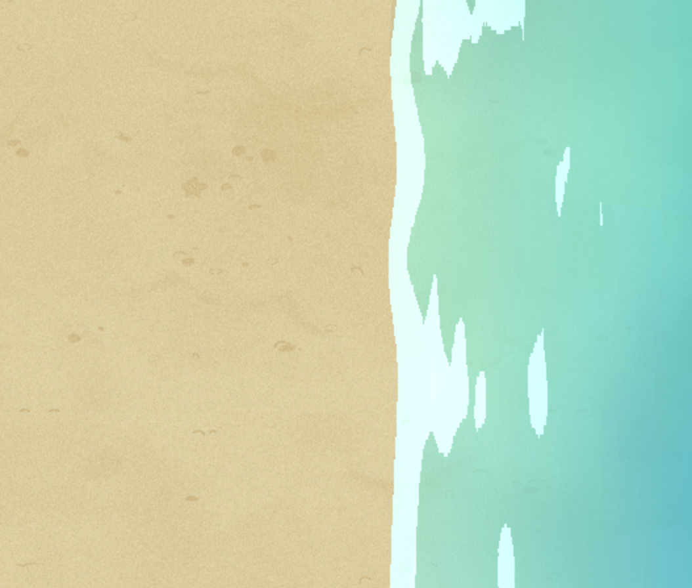

# OpenFL Seawater Shader
It uses shaders to achieve basic seawater effects, such as shadows, waves, etc.

# Run
- Install openfl-glsl:`haxelib git openfl-glsl https://github.com/rainyt/openfl-glsl`
- Install OpenFl and Lime:`haxelib install openfl; haxelib install lime; openfl setup`
- Test it:`lime test html5`